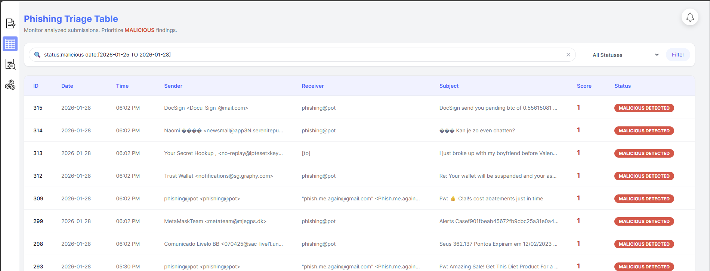

# 📧 Phishing Email Triage Analyzer
 



The Phishing Email Triage & Analyzer is a lightweight web application built with Flask and SQLite designed for the rapid triage and analysis of suspicious email files (.eml and .msg). It automatically parses uploaded emails for key indicators of compromise (IOCs) completely in-memory, executes background threaded checks against the VirusTotal v3 API, and supports optional integration with Gemini for conversational insights.

## ✨ Features
* File Upload & Parsing: Accepts .eml and .msg files, extracting key forensic data entirely in-memory.
* IOC Extraction: Automatically pulls Subject, Sender, Receiver, Received IPs, and Embedded URLs.
* Attachment Hashing: Calculates SHA256 hashes for all attachments.
* VirusTotal Integration: Performs live lookups for extracted URLs, Attachment Hashes, and IPs against the VirusTotal v3 API.
* Gemini AI Analysis: Leverages the Gemini API for advanced threat summarization and context.
* Persistent Storage: Stores all analysis results, including a local VT report cache, in a SQLite database (`database.db`).
* Web Dashboard & Background Processing: Provides a centralized dashboard with asynchronous background analysis handled by a thread pool.
* Detailed View: Offers a comprehensive detail page for each email, including direct links to full raw VirusTotal reports for further investigation.

## 🛠️ Installation
> [!IMPORTANT]
> You need Python 3.8+ installed on your system.

Clone this repository or download the script.
1. Install a virtual environment
   ```python
   python -m venv venv
   ```
2. Activate virtual environment (CMD)
   ```
   venv\Scripts\activate.bat
   ```
   If your terminal shows this: ***cannot be loaded because running scripts is disabled on this system***
   Go to [Managing the execution policy with PowerShell](https://learn.microsoft.com/en-us/powershell/module/microsoft.powershell.core/about/about_execution_policies?view=powershell-7.5#managing-the-execution-policy-with-powershell)
   enable
   ```
   Set-ExecutionPolicy -ExecutionPolicy RemoteSigned -Scope CurrentUser
   ```
   
3. Install the required Python packages using pip:
   ```python
   pip install -r requirements.txt
   ```
## ⚙️ Configuration
The application requires API keys for full analysis functionality. You must set these keys in a local `.env` file.
1. Create a `.env` file in the root directory of the project.
2. Add your keys using the following variables:
   ```.env
   VIRUSTOTAL_API_KEY="YOUR_VIRUSTOTAL_API_KEY_HERE"
   GEMINI_API_KEY="YOUR_GEMINI_API_KEY_HERE"
   FLASK_DEBUG="False"
   ```
> [!NOTE]
> You need an API key that supports v3 lookups (typically a free/public key works for basic scanning)

## 🚀 Running the Application
1. Initialize the Database: The application will automatically create the database.db file and the emails table when run for the first time.
2. Start the Flask Server:
   ```python
   python app.py
   ```
3. Access the Dashboard: Open your browser and navigate to: http://127.0.0.1:5000/

> [!WARNING]
> **API Rate Limits:** The background analysis pipeline introduces a 15-second delay between each call to the VirusTotal API (for URLs, File Hashes, and IPs) to comply with typical free-tier rate limits (4 requests per minute). Processing a single complex email with multiple IOCs will take time.
> **Gemini API Limits:** Be aware of the Google Gemini free API limitations when utilizing the AI insight features.
> **File Handling:** The original uploaded files are read entirely into memory (RAM) and processed using a ThreadPoolExecutor. They are never written to the disk.
> **Security:** This application should not be exposed publicly without proper authentication measures. It is meant for internal use only by an analyst on a secure network. The Flask `SECRET_KEY` config should be updated before deployment.
