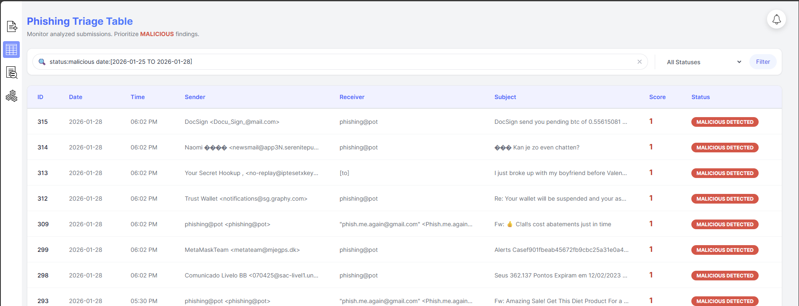

# Phishing Email Triage Analyzer

[](https://github.com/isuruum/Phishing-Email-Triage-Analyzer) [](https://www.python.org/) [](https://github.com/isuruum/Phishing-Email-Triage-Analyzer/actions/workflows/python-app.yml) [](https://flask.palletsprojects.com/) [](https://www.sqlite.org/)

Phishing Email Triage Analyzer is an educational Flask application for investigating suspicious `.eml` and `.msg` files. It extracts email indicators of compromise (IOCs), hashes attachments, stores results in SQLite, and runs background VirusTotal checks. Optional Gemini integration provides an additional threat summary.



> **Important:** This application is intended for internal analyst use on a trusted network. It does not provide user authentication and should not be exposed publicly without additional security controls.

## Features

- Upload and parse `.eml` and `.msg` files in memory.
- Extract subjects, senders, recipients, received IP addresses, URLs, and attachment SHA-256 hashes.
- Query VirusTotal v3 for URLs, hashes, and IP addresses.
- Store analysis sessions, IOC data, and cached VirusTotal reports in `database.db`.
- Process uploads and external lookups with a background thread pool.
- Browse a searchable triage table, an analysis dashboard, and per-email detail pages.
- Optionally request Gemini-powered analysis through the server-side proxy.
- Receive real-time analysis completion notifications from any application page.

## Repository layout

| Path | Purpose |
| --- | --- |
| `app.py` | Flask application, routes, database setup, parsing, background analysis, and API integrations |
| `templates/` | Jinja pages for submission, triage table, dashboard, detail, and information views |
| `static/global_notifications.js` | Shared toast, notification bell, panel, persistence, and status-polling implementation |
| `static/sidebar_loader.js` | Dynamically injected navigation sidebar |
| `static/detail_refresh.js` | Polls an individual detail page while its analysis is pending |
| `static/table_view_refresh.js` | Refreshes triage-table rows while analyses are running |
| `static/network_check.js` | Client-side network availability checks |
| `static/dist/tailwind.css` | Compiled utility styles used by the templates |
| `database.db` | Runtime SQLite database, created automatically on first startup |
| `requirements.txt` | Python dependencies |
| `.github/workflows/python-app.yml` | Continuous integration workflow |

## Installation

Python 3.8 or newer is required.

### Windows PowerShell

```powershell
git clone https://github.com/isuruum/Phishing-Email-Triage-Analyzer.git
cd Phishing-Email-Triage-Analyzer
python -m venv venv
.\venv\Scripts\Activate.ps1
pip install -r requirements.txt
```

If PowerShell blocks script activation for the current user:

```powershell
Set-ExecutionPolicy -ExecutionPolicy RemoteSigned -Scope CurrentUser
```

### Windows Command Prompt

```bat
python -m venv venv
venv\Scripts\activate.bat
pip install -r requirements.txt
```

### Linux or macOS

```bash
git clone https://github.com/isuruum/Phishing-Email-Triage-Analyzer.git
cd Phishing-Email-Triage-Analyzer
python3 -m venv venv
source venv/bin/activate
pip install -r requirements.txt
```

## Configuration

Create a `.env` file in the repository root. The application reads it through `python-dotenv`:

```dotenv
VIRUSTOTAL_API_KEY=your_virustotal_api_key
GEMINI_API_KEY=your_gemini_api_key
SECRET_KEY=replace_with_a_long_random_value
FLASK_DEBUG=False
```

`VIRUSTOTAL_API_KEY` is required for live VirusTotal lookups. `GEMINI_API_KEY` is required only for Gemini analysis. Keep `.env` out of version control and use a strong `SECRET_KEY` outside local development.

## Running the application

Start the development server from the activated virtual environment:

```bash
python app.py
```

Open <http://127.0.0.1:5000/>. The first start creates the SQLite database and required tables automatically.

The main routes are:

| Route | Purpose |
| --- | --- |
| `/` | Upload suspicious email files |
| `/table_view` | Search and inspect stored triage sessions |
| `/analyze_dashboard` | View analysis statistics and usage |
| `/detail/<id>` | View one email's extracted data and reports |
| `/info` | Display application information |
| `/api/analysis_status` | Return current analysis sessions for polling |

## Notification system

The notification system is implemented in `static/global_notifications.js` and is loaded by the submission, table, dashboard, detail, and information templates. It is intentionally client-side: notification history belongs to the browser profile rather than the SQLite database or a user account.

### End-to-end behavior

1. On page load, the script uses the `GLOBAL_NOTIFICATIONS_LOADED` guard so it is initialized only once per page.
2. It injects its CSS and creates the toast container, notification bell, and notification panel if they do not already exist.
3. It polls `GET /api/analysis_status` immediately and then every five seconds.
4. Sessions currently in `ANALYZING_VT` are tracked in an in-memory `pendingIds` set.
5. When a tracked session changes to a terminal status, the script creates a toast and persists a notification:
   - `MALICIOUS_DETECTED` → `error`
   - `FAILED` → `failed`
   - any other completed status → `success`
6. Each notification links to `/detail/<id>`, and a custom `analysisCompleted` event is dispatched so dashboard components can refresh.
7. Identical messages are not stored twice. The current duplicate check compares the complete message text.
8. The browser `storage` event keeps open tabs synchronized when notification history changes.

Only transitions observed after the current page has loaded can create a notification. Existing completed rows are not replayed as new alerts because the pending set is populated only when a row is observed as `ANALYZING_VT`.

### Toast styling and behavior

Toasts appear at the top center of the viewport:

- `20px` from the top, `90%` width, and `800px` maximum width.
- White background, light gray border, `6px` colored left border, `4px` radius, and a soft two-layer shadow.
- `16px 20px` padding and `0.95rem` text.
- Success uses a green `✓` and `#28a745`.
- Error uses a red `⚠` and `#dc3545`.
- Failed uses an amber `⚠` and `#EAB308`.
- Toasts animate from `translateY(-20px)`/transparent to their visible position.
- Completion toasts remain visible for six seconds, then fade out over `400ms`.
- Clicking a toast navigates to its detail URL when one is available; otherwise it only dismisses the toast.
- Empty space around the toast stack does not block page interaction.

The upload page and some server-flash-message templates contain older `.message` toast styles. The shared notification implementation uses the `.global-toast` class and should be the source of truth for new global completion alerts.

### Bell icon and panel design

The bell is injected at `fixed; top: 20px; right: 30px` with a `45px` white circular surface, a soft shadow, and an externally hosted Icons8 appointment-reminder image sized to `24px`. Hovering scales it to `1.05` and increases the shadow. The red unread badge is hidden at zero, shows the unread count above zero, and caps the displayed value at `99+`.

Clicking the bell toggles a fixed notification panel below it (`top: 75px; right: 30px`). The panel is `450px` wide, up to `500px` tall, white, rounded to `12px`, bordered, and given a larger shadow. It opens with a short fade/slide/scale transition. Clicking outside the bell or panel closes it.

The panel contains:

- A light-gray header titled **Notifications**.
- **Mark all read**, which marks every stored item read and clears the unread badge.
- **Delete All**, which removes all stored notifications.
- A scrollable list with a `400px` body limit.
- An empty state with the Icons8 “nothing found” image when there are no items.
- Success/error/failed circular status icons, message text, relative time, and a per-item delete button revealed on hover.
- Clicking an item with a URL opens its detail page. Clicking its delete button removes only that item.

Notification records use the following shape in `localStorage` under `email_triage_notifications`:

```json
{
  "id": 1710000000000,
  "msg": "Analysis complete for ID 12: CLEAN ANALYZED",
  "type": "success",
  "url": "/detail/12",
  "read": false,
  "timestamp": "2026-03-01T10:15:00.000Z"
}
```

### Notification implementation instructions

To add the system to a new template:

```html
<script src="{{ url_for('static', filename='global_notifications.js') }}"></script>
```

The page must load the script after `document.body` exists. The script creates its own DOM elements, so no bell or panel markup is required in the template.

To change the visual design, update the injected CSS in `static/global_notifications.js`. Keep these selectors and state classes stable unless the JavaScript is updated at the same time:

`#notification-bell`, `.bell-badge`, `#notification-panel`, `#notification-panel.open`, `.global-toast`, `.global-toast.show`, `.notification-item`, `.notification-item.unread`, `.success`, `.error`, and `.failed`.

To change what triggers an alert, update the terminal-status mapping in `pollStatus()`. The backend must continue returning an array from `/api/analysis_status` with at least `id` and `status`. If statuses are renamed in `app.py`, update the mapping and the dashboard/detail status labels together.

When changing persistence behavior, preserve the `email_triage_notifications` key format or migrate existing records deliberately. `localStorage` is per origin and can be cleared by the user, so it must not be treated as an audit log.

## Analysis status model

The notification poller recognizes `ANALYZING_VT` as in progress. Terminal statuses currently produced by the application include:

- `MALICIOUS_DETECTED` — one or more VirusTotal checks reported flags.
- `CLEAN_ANALYZED` — IOCs were checked without flags.
- `CLEAN_NO_IOCS` — no checkable IOCs were found.
- `FAILED` — background processing failed or an analysis exceeded the stale-session timeout.

VirusTotal lookups are deliberately rate-limited with delays between requests. A message containing multiple URLs, hashes, or IPs can therefore take several minutes on free-tier limits.

## Testing and CI

The GitHub Actions workflow in `.github/workflows/python-app.yml` installs the dependency file and runs the repository's Python checks. Run the same project checks locally when making changes:

```bash
python -m compileall app.py
```

For notification changes, manually verify: a completion transition, unread badge count, opening/closing the panel, mark-all-read, per-item deletion, Delete All, a detail-page click, and synchronization between two tabs.

## License

See [LICENSE](LICENSE).
